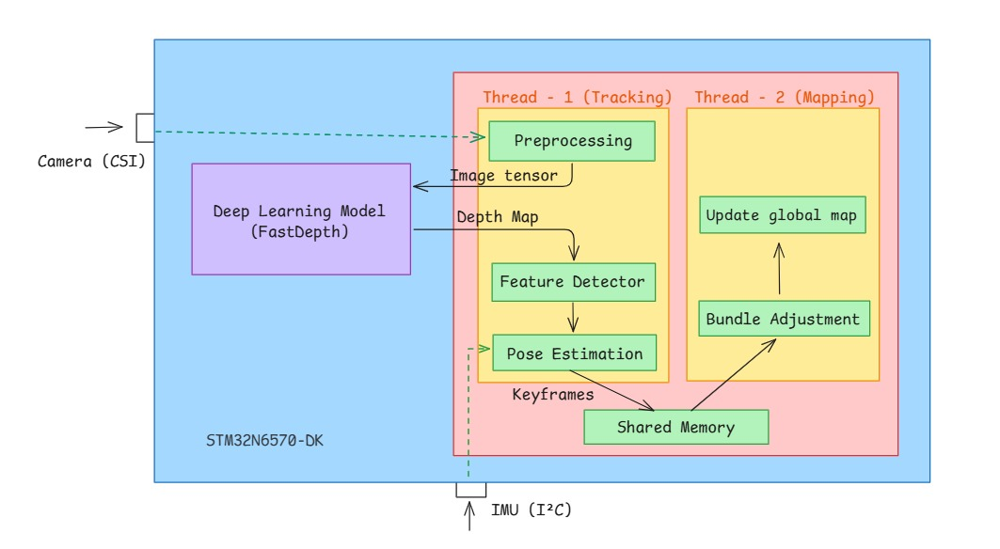
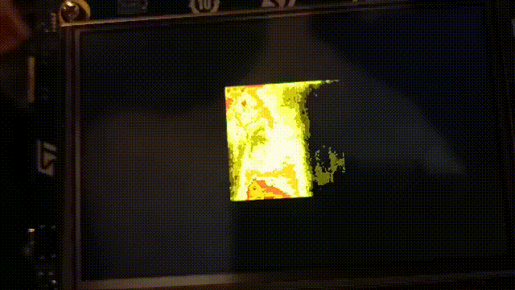
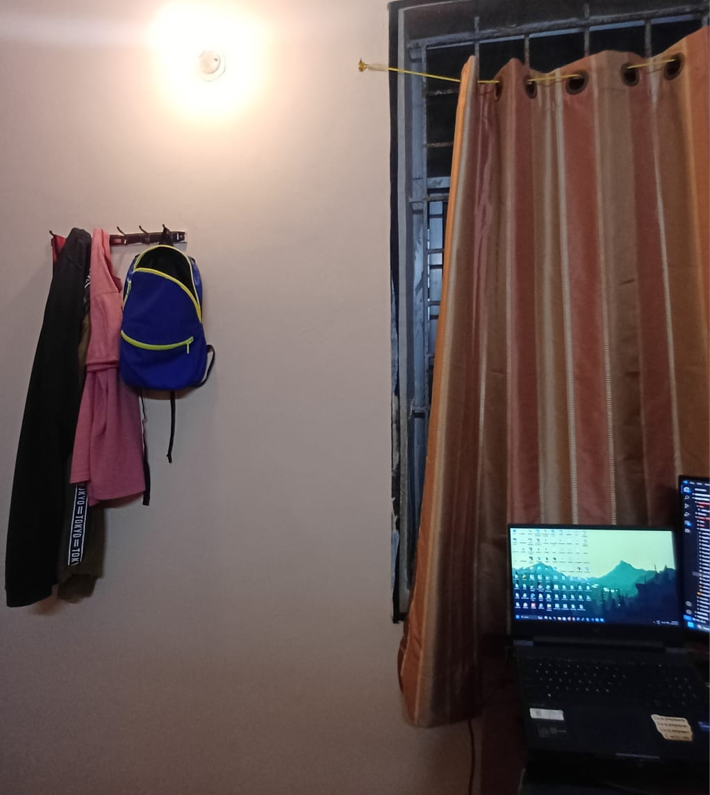

# Visual Inertial SLAM

This project aims to develops a robust, real-time Simultaneous Localization and Mapping (SLAM) system for resource-constrained embedded platforms. It innovatively replaces conventional LIDAR sensing with a Neural Network (NN) that generates a Synthetic Point Cloud (SPCG) from camera input. This synthetic 3D data is then fused with odometry from an Inertial Measurement Unit (IMU) and classical Computer Vision (CV) algorithms to achieve accurate six-degrees-of-freedom pose estimation and precise environmental mapping.

## Project Directory Structure  (Main Program)

```
Application
├── Inc
│   ├── imu_int.h
│   ├── nnlib.h
│   └── slam
│       ├── data_structs.h
│       ├── feature_detect
│       │   └── feature_detect.h
│       ├── feature_match
│       │   └── feature_match.h
│       ├── file_manager.h
│       ├── init_map
│       │   └── init_map.h
│       ├── intrinsics.h
│       ├── loader.h
│       ├── map.h
│       ├── math_structs.h
│       ├── stb_image.h
│       ├── svd.h
│       ├── tracking
│       │   ├── lucasKanade.h
│       │   ├── pose_only_ba.h
│       │   └── track_frames.h
│       └── triangulate.h
└── Src
    ├── app_main.c
    ├── imu_int.c
    ├── nnlib.c
    ├── slam
    │   ├── compute_svd
    │   │   └── svd_recover_pose.c
    │   ├── dec_ess_triangulate
    │   │   └── dec_ess_triangulate.c
    │   ├── feature_detect
    │   │   ├── BRIEF.c
    │   │   ├── FAST.c
    │   │   └── feature_extract.c
    │   ├── feature_match
    │   │   └── feature_match.c
    │   ├── init_map
    │   │   └── init_map.c
    │   ├── mapping
    │   │   └── map.c
    │   ├── math_struct.c
    │   └── tracking_thread
    │       ├── lucasKanade
    │       │   └── lucasKanade.c
    │       ├── pose_only_ba.c
    │       └── track_frames.c
    └── slam_api.c
```

- Binary/ - Binary files of this project, which can be flashed to the board
- Application/ : Contains the main program (RTOS main), SLAM logic (Heart of this project) and related libraries
- Core/ : Contatins initialization codes and main program of this project
- Middlewares/ : Camera and LCD codes
- STM32Cube_FW_N6/ : BSP, CMSIS and HAL Drivers

## Block diagram




## Main Idea and Working of the project

The system operates through an integrated sensor fusion and computer vision pipeline:

1. Synthetic Depth Generation: The camera feed is processed by the NPU-accelerated ML model, producing a synthetic depth map (or sparse point cloud) that mimics LIDAR output in real-time.

2. Feature Tracking: Classical Computer Vision (CV) algorithms, such as Lucas-Kanade, use the current and prior camera frames (along with the synthetic depth data) to accurately track key features and estimate relative motion.

3. IMU Pose Estimation: An Inertial Measurement Unit (IMU) provides high-frequency odometry data (acceleration and rotation). This data is integrated and corrected using a Complementary Filter to provide robust, drift-corrected short-term pose estimates.

4. Fusion and Refinement: All data streams are fused: the synthetic depth, the CV feature tracking, and the IMU pose. Final global consistency is achieved using Bundle Adjustment, which minimizes projection errors across multiple frames to generate a precise, drift-corrected six-degrees-of-freedom pose and an accurate map of the environment.

## Testing the application

Use STM32_SigningTool_CLI to flash the binary files to the board.
The Binary/ dir contains two application code, one is depth_map_rtos and imu.
- depth_map_rtos : Shows depth map which is processed from npu onto LCD screen
- imu : View imu data in Serial monitor (Baud rate - 115200, Parity - None, Data Bits - 8)

```
(Flash fsbl.hex)
STM32_Programmer_CLI -c port=SWD mode=HOTPLUG -el Loader/MX66UW1G45G_STM32N6570-DK.stldr -hardRst -w fsbl.hex 0x70000000

(Flash application)
STM32_Programmer_CLI -c port=SWD mode=HOTPLUG -el Loader/MX66UW1G45G_STM32N6570-DK.stldr -hardRst -w depth_map_rtos.bin 0x70100000

(Flash network data)
STM32_Programmer_CLI -c port=SWD mode=HOTPLUG -el Loader/MX66UW1G45G_STM32N6570-DK.stldr -hardRst -w network_data_fastdepth.hex 0x71000000
```

## Demo





